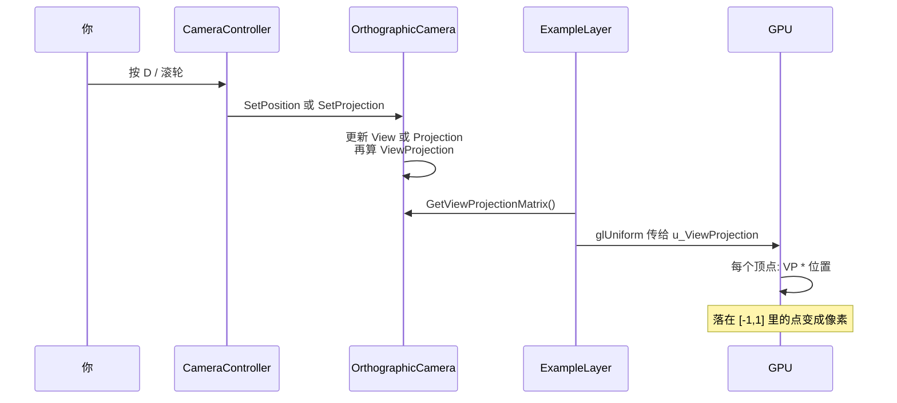

# 正交相机矩阵入门

> 对应代码：`OpenGL-Core/src/GLCore/Util/OrthographicCamera.cpp`  
> 读者假定：几乎没学过线性代数，只知道「矩阵能把点挪来挪去」。

这篇只讲一件事：**游戏里的「相机」不是真去拍一张照片，而是在问——世界那么大，屏幕这一帧该显示哪一块？**

`OrthographicCamera` 用三个 4×4 矩阵回答这个问题。读完你应该能指着源码说：这行在干什么、画面上会变成什么样。

---

## 1. 先忘掉矩阵，想一块「取景框」

想象一张无限大的图纸（**世界**）。图纸上有一个正方形，四个角是：

```
(-0.5,  0.5)        (0.5,  0.5)
        ┌───────────┐
        │           │
        │   四边形   │     ← ExampleLayer 里那个彩色方块
        │           │
        └───────────┘
(-0.5, -0.5)        (0.5, -0.5)
```

屏幕只有这么大。你必须规定：**图纸上哪一块矩形，要铺满整个窗口。**

这块矩形就是相机的**可见范围**。正交相机（Orthographic）的特点是：

- 没有近大远小，像 CAD、2D 游戏、地图
- 远处的东西不会变小
- 本项目的 `near/far` 写成 `-1` 和 `1`，几乎只是占位：这是 2D 相机，深度不重要

可以把它想成：你拿一个矩形相框扣在图纸上。相框里的内容被「拍」到屏幕上。

```
世界图纸（无限）

        ┌──────────────────────────────┐
        │                                │
        │     ┏━━━━━━━━━━━━━━┓          │  ← 相框 = 相机看到的范围
        │     ┃   方块在这里   ┃          │
        │     ┗━━━━━━━━━━━━━━┛          │
        │                                │
        └──────────────────────────────┘

相框里的内容  ──铺满──▶  整个游戏窗口
```

**移动相机** = 把相框在图纸上挪走。  
**旋转相机** = 把相框转一个角度。  
**缩放** = 把相框变大（看得更多、物体显得更小）或变小（拉近）。

矩阵只是把上面三句话翻译成 GPU 能算的数字。

---

## 2. 顶点要经过哪几站

一个顶点从「我写在数组里的坐标」到「屏幕上的像素」，中间换了好几次坐标系。本项目里，着色器只乘**一个**矩阵 `u_ViewProjection`，但这个矩阵是另外两个乘出来的。


| 空间 | 人话 | 本项目里谁负责 |
|---|---|---|
| 世界坐标 | 物体在图纸上的位置。方块中心在原点，边长 1 | 顶点数组写死 `±0.5` |
| 视图 / 相机空间 | 「假如相机坐在原点、正对前方，世界该怎么挪」 | **View 矩阵** |
| NDC（标准化设备坐标） | OpenGL 规定：能看见的东西必须落在 `x,y ∈ [-1, 1]` 的正方形里 | **Projection 矩阵** |
| 屏幕像素 | 窗口左下是 `(0,0)`，右上是 `(宽, 高)` | GPU 根据视口自动映射，代码不用写 |

着色器里只有一行：

```glsl
gl_Position = u_ViewProjection * vec4(a_Position, 1.0);
```

`u_ViewProjection` 就是 `Projection * View`。一次乘法走完「世界 → 相机 → NDC」。

> 为什么 `w` 写成 `1.0`？三维里用 4 个数表示一个点 `(x, y, z, w)`。`w = 1` 表示这是一个**位置**；`w = 0` 表示方向（平移不影响它）。这里当点用，补 1 即可。

---

## 3. 三个矩阵分别是什么

类里存了三个 `glm::mat4`（4×4 浮点矩阵）：

| 成员 | 名字 | 一句话 |
|---|---|---|
| `m_ProjectionMatrix` | 投影矩阵 | 「相框有多大」：把可见矩形压进 `[-1, 1]` |
| `m_ViewMatrix` | 视图矩阵 | 「相框在哪、转了多少度」：把世界挪到相机面前 |
| `m_ViewProjectionMatrix` | 视图投影矩阵 | 上面两个的乘积，直接交给着色器 |

构造时（相机还在原点、没旋转）：

```cpp
m_ProjectionMatrix = glm::ortho(left, right, bottom, top, -1.0f, 1.0f);
m_ViewMatrix       = 单位矩阵;   // 写成 glm::mat4(1.0f)，表示「什么都不做」
m_ViewProjectionMatrix = m_ProjectionMatrix * m_ViewMatrix;
```

单位矩阵就像乘 1：点乘完还是自己。相机在原点且不转时，View 不起作用，只靠投影把世界矩形压到 NDC。

---

## 4. 投影矩阵：把「相框」压成 `[-1, 1]` 正方形

### 4.1 `glm::ortho` 在干什么

```cpp
glm::ortho(left, right, bottom, top, -1.0f, 1.0f)
```

六个参数是相框的六面墙：

```
            top = 上边界
         ─────────────
        │             │
 left   │    可见区    │  right
        │             │
         ─────────────
            bottom = 下边界

        眼睛朝向你（2D 里 z 几乎不管）
        near = -1    far = 1
```

**规则极简单：**

- 世界坐标 `x = left`  → 屏幕最左边（NDC 的 `-1`）
- 世界坐标 `x = right` → 屏幕最右边（NDC 的 `+1`）
- 世界坐标 `y = bottom` → 屏幕最下边
- 世界坐标 `y = top`    → 屏幕最上边

中间的点按比例线性插值。没有透视，所以叫**正交**。

### 4.2 数字例子：默认 16:9 相机

`OrthographicCameraController` 构造时（`zoom = 1`，宽高比 `16/9`）：

```cpp
left   = -16/9 ≈ -1.778
right  =  16/9 ≈  1.778
bottom = -1
top    =  1
```

相框是一个扁的矩形：横向大约 `±1.78`，纵向 `±1`。

方块顶点在 `±0.5`。它完整落在相框里，所以会出现在窗口**中央偏中等大小**的位置：

```
NDC / 屏幕（始终是 -1 到 1 的正方形，再被拉成窗口形状）

(-1,1)                          (1,1)
  ┌────────────────────────────────┐
  │                                │
  │          ┌──────┐              │
  │          │ 方块  │              │   方块只占中间一小块
  │          └──────┘              │   因为 ±0.5 比 ±1.78 小得多
  │                                │
  └────────────────────────────────┘
(-1,-1)                         (1,-1)
```

滚轮拉远（`zoom` 变大）时，`left/right/bottom/top` 一起变大，相框变大，同样的 `±0.5` 方块在屏幕上显得更小。这就是「缩放」的本质：**没改方块，改了相框。**

### 4.3 一个点怎么被投影（直觉，不必背公式）

假设相框是 `left=-2, right=2, bottom=-1, top=1`。世界点 `(0, 0)`：

- 正好在左右中间 → NDC `x = 0`（屏幕正中）
- 正好在上下中间 → NDC `y = 0`

世界点 `(2, 1)`：刚好在相框右上角 → NDC `(1, 1)` → 窗口右上角。

世界点 `(3, 0)`：在相框**外面** → NDC `x > 1` → 被裁掉，屏幕上看不见。

`SetProjection` 就是运行时换一套 `left/right/bottom/top`，再重算投影矩阵。窗口拉伸、滚轮缩放都会走到这里。

---

## 5. 视图矩阵：为什么是「相机变换的逆」

### 5.1 一个反直觉但关键的事实

GPU **不会**真的把相机放到世界里四处走。它只会变换**顶点**。

所以「相机向右走 2 米」在数学上等于：**整个世界向左走 2 米**。相对关系一样，屏幕上看起来就是相机动了。

```
真实想做的事：相机从原点走到 x=2，方块仍在原点

世界:     相机C ------>  方块□
          原点          x=2

GPU 实际做的事：相机假装留在原点，世界整体左移 2

          方块□  <------  相机C(原点)
          x=-2            原点

两种看法：方块都在相机「左边 2 米」→ 画面相同
```

所以：

```
视图矩阵 View  =  inverse(相机自己的世界变换)
```

相机往哪走，世界就往**反方向**挪。

### 5.2 代码在构造「相机自己的变换」

```cpp
glm::mat4 transform =
    glm::translate(glm::mat4(1.0f), m_Position) *
    glm::rotate(glm::mat4(1.0f), glm::radians(m_Rotation), glm::vec3(0, 0, 1));

m_ViewMatrix = glm::inverse(transform);
```

拆开看：

1. `glm::mat4(1.0f)`  
   单位矩阵，从「什么都没做」开始。

2. `glm::rotate(..., 绕 Z 轴, m_Rotation 度)`  
   2D 画面在 xy 平面上，绕 Z 转就是把相框转一下。  
   `glm::radians` 把度数换成弧度（`glm::rotate` 要弧度）。

3. `glm::translate(..., m_Position)`  
   把相框中心挪到 `m_Position`。

4. 两个矩阵相乘  
   GLM / OpenGL 是**列主序**，矩阵从**右边先作用到点**：

   ```
   点  先被  rotate 转到  再被  translate 挪走
   ```

   也就是：先原地旋转，再平移到 `m_Position`。这正是「先转身体，再走到新位置」。

5. `glm::inverse(transform)`  
   取逆：世界做相反的事。

### 5.3 数字例子：相机走到 `(2, 0)`，不旋转

- 相机变换：把原点挪到 `(2, 0)`
- 逆变换：把整个世界往左挪 2
- 方块顶点原来是 `(0.5, 0)`，乘完 View 变成 `(-1.5, 0)`

也就是：方块相对相机跑到了左边。屏幕上你会看到方块跑到窗口偏左——看起来像你把相机往右推了。

```
移动前（相机在原点）          按 D 键相机右移之后

窗口:                         窗口:
┌──────────────┐              ┌──────────────┐
│    [方块]     │              │[方块]         │
│      ↑        │              │               │
│   在正中央    │              │  方块偏左了    │
└──────────────┘              └──────────────┘

方块没动。动的是相框。
```

### 5.4 旋转同理

`m_Rotation = 90`：相框逆时针转 90°。逆矩阵会让世界顺时针转 90°。于是你觉得「相机转了」，其实是世界在反着转。

2D 只绕 Z，所以旋转轴写死 `glm::vec3(0, 0, 1)`。

---

## 6. 为什么是 `Projection * View`，不能写反

每一帧都有：

```cpp
m_ViewProjectionMatrix = m_ProjectionMatrix * m_ViewMatrix;
```

着色器：

```glsl
gl_Position = u_ViewProjection * vec4(a_Position, 1.0);
```

合在一起（矩阵乘法满足结合律）：

```
gl_Position = Projection * View * 点
```

列主序：**最右边的矩阵最先作用到点上**。

```
世界点
  │
  │  先乘 View      →  变到「相机坐在原点」的坐标系
  ▼
  │  再乘 Projection →  把相机看到的那块矩形压进 [-1, 1]
  ▼
NDC，GPU 再画到屏幕
```

如果写成 `View * Projection`，等于先按相框压坐标、再按相机挪，空间全乱，方块会飞到错误位置。

**口诀：先 View（对准相机），再 Projection（压进屏幕）。写代码时 Projection 在左边。**

---

## 7. 对照源码：每一段在干什么

### 构造函数：第一次把三张表填好

```cpp
OrthographicCamera::OrthographicCamera(float left, float right, float bottom, float top)
    : m_ProjectionMatrix(glm::ortho(left, right, bottom, top, -1.0f, 1.0f)),
      m_ViewMatrix(1.0f)   // 单位阵：相机在原点、不转
{
    m_ViewProjectionMatrix = m_ProjectionMatrix * m_ViewMatrix;
}
```

| 代码 | 效果 |
|---|---|
| `glm::ortho(...)` | 按传入的相框大小生成投影 |
| `m_ViewMatrix(1.0f)` | 还没移动，视图等于「什么都不做」 |
| 两者相乘 | 着色器马上能用的最终矩阵 |

初始化列表里直接构造矩阵，比先默认构造再赋值少一次多余工作。

### `SetProjection`：只换相框大小

窗口变了、滚轮缩放了，调用这个。View（相机位置）不变，但最终矩阵必须重乘，否则着色器还拿着旧的组合结果。

### `RecalculateViewMatrix`：位置或角度变了

`SetPosition` / `SetRotation` 里会调用它。步骤就是第 5 节：先造相机变换，再取逆，再和投影乘在一起。

**实现效果总结：**

| 你在游戏里做的事 | 代码路径 | 画面 |
|---|---|---|
| WASD 移动 | `SetPosition` → 重算 View | 相框平移，世界看起来反方向滑 |
| QE 旋转（若开启） | `SetRotation` → 重算 View | 相框旋转，世界反着转 |
| 滚轮 | `SetProjection` 换更大/更小的 ortho | 相框缩放，物体变小/变大 |
| 窗口拉伸 | 同样 `SetProjection`，按新宽高比 | 方块不变形 |

---

## 8. 整条链路：从键盘到像素



`ExampleLayer` 每帧只做一件和相机有关的事：把最终矩阵塞进着色器。它不管矩阵怎么乘，那是相机类的工作。

---

## 9. 一张总图记住三个矩阵

```
                    m_Position, m_Rotation
                            │
                            ▼
              ┌─────────────────────────┐
              │  相机自己的世界变换 T      │
              │  平移 * 绕 Z 旋转         │
              └────────────┬──────────────┘
                           │ inverse
                           ▼
              ┌─────────────────────────┐
              │  View                     │  「世界反着动」
              │  m_ViewMatrix              │
              └────────────┬──────────────┘
                           │
  left,right,bottom,top     │
           │               │
           ▼               │
  ┌─────────────────┐     │
  │  Projection      │     │
  │  glm::ortho(...) │     │
  └────────┬────────┘     │
           │               │
           └───────┬───────┘
                   │  Projection * View
                   ▼
         ┌─────────────────────┐
         │  ViewProjection       │  交给 shader
         │  u_ViewProjection     │
         └──────────┬──────────┘
                    │  × 顶点 (x,y,z,1)
                    ▼
              屏幕上的方块
```

---

## 10. 常见卡住的点

**Q: 矩阵是不是很难？**  
这份代码里你不需要手算 4×4。记住三句话就够：投影=相框大小；视图=相机怎么放的逆；最终=投影乘视图。

**Q: 单位矩阵为什么是 `glm::mat4(1.0f)`？**  
对角线上全是 1、别处是 0 的矩阵。乘任何点都不变。相机在原点且不转时，View 就是它。

**Q: 为什么 near/far 是 -1 和 1？**  
3D 透视相机会认真用这两个值管远近裁剪。这里是 2D，方块全在 `z=0`，写成 ±1 只是让 ortho 公式完整。

**Q: 方块顶点为什么不用乘「模型矩阵」？**  
完整管线其实是 `Projection * View * Model * 点`。本示例方块写死在世界原点附近，没有再平移/旋转物体，Model 相当于单位阵，直接省掉了。以后要「很多个方块各在不同位置」，就会给每个物体单独一个 Model 矩阵。

**Q: 按 D 方块往左跑，是不是写反了？**  
没反。相机右移，相框往右扣，原来在中央的方块就出现在相框左边，所以屏幕上往左。这正是「View = 逆变换」的直观结果。

---

## 11. 建议你对着代码做的三件事

1. 运行 `OpenGL-Examples`，按 WASD，边看画面边在脑子里说：「相框在挪，View 在取逆。」
2. 滚轮拉远，想象 `left/right/bottom/top` 数字变大，方块在 NDC 里占比变小。
3. 打开 `OrthographicCamera.cpp`，给三处赋值各加一句注释：哪一个是相框、哪一个是逆、哪一个是乘完交给 GPU。

相关文件：

- 相机本体：`OpenGL-Core/src/GLCore/Util/OrthographicCamera.cpp`
- 键盘 / 滚轮怎么改这些数：`OrthographicCameraController.cpp`
- 矩阵怎么进 GPU：`OpenGL-Examples/src/ExampleLayer.cpp` 的 `glUniformMatrix4fv`
- 顶点怎么乘矩阵：`OpenGL-Examples/assets/shaders/test.vert.glsl`
